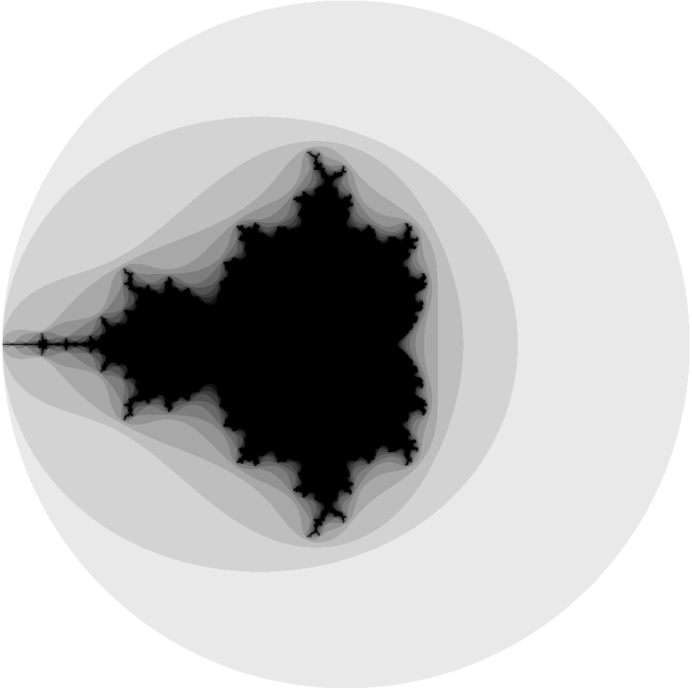
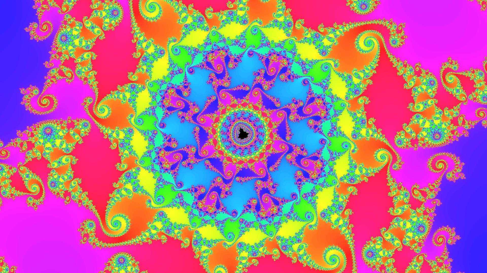
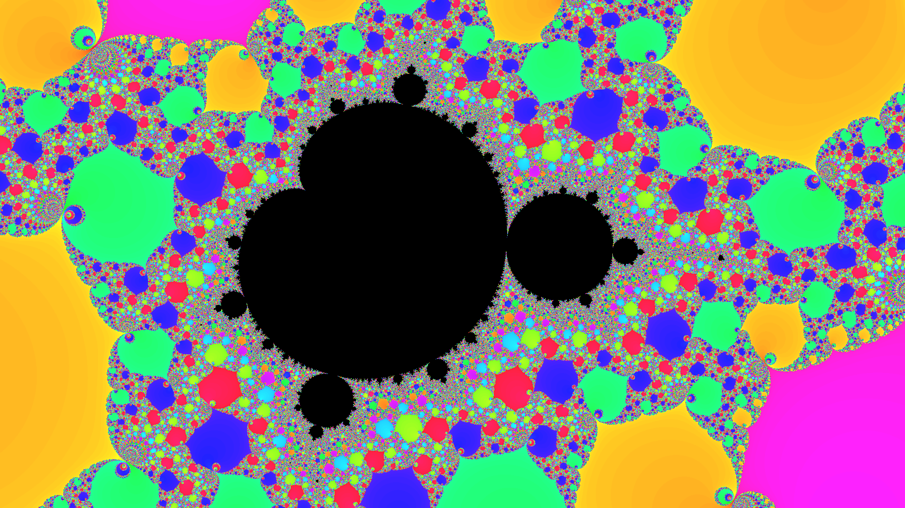

Wiki: [Mandelbrot set](https://en.wikipedia.org/wiki/Mandelbrot_set)

The Mandelbrot set is a fractal set of complex numbers $c \in \mathbb{C}$ for which the sequence

$$
\begin{aligned}
z_0 &= 0 \\
z_{n+1} &= z_n^2 + c \space\space\space\space\space n \in \mathbb{N}
\end{aligned}
$$

does not diverge. Whan visualizing the Mandelbrot Set, the color of each point is usually dependent on the number of iterations it takes for the sequence to diverge. You may ask, how do you decide that the sequence has diverged? It turns out that if $|z_k| > 2$ for some $k \in \mathbb{N}$, then the sequence will definetly diverge (the proof is rather simple). So, if $|z_n| > 2$, we can stop the iteration and color the point based on the number of iterations it took to reach this condition.

In the figure above we did 7 iteration and used grayscale to represent the number of iterations. If $c \in \mathbb{C}$ is outside this circle of radius 2, then $z_1 = c$, so we conclude after the first iteration that the sequence will diverge. The darkness of the other regions is proportional to how many itarations we need to conclude that the sequence will diverge. We color a point black we cannot conclude that sequence will diverge after we exhausted our number of iteration (7 in the case of the picture). The Mandelbrot set is defined as the limit set of the points for which the sequence does not diverge.

The GIF below shows a zoom on the boundary of the Mandelbrot set, with fancy colors.

Also, here are some screenshots I took while exploring the Mandelbrot set. I find them quite beautiful :) You can find more in the [results](./results) folder.

