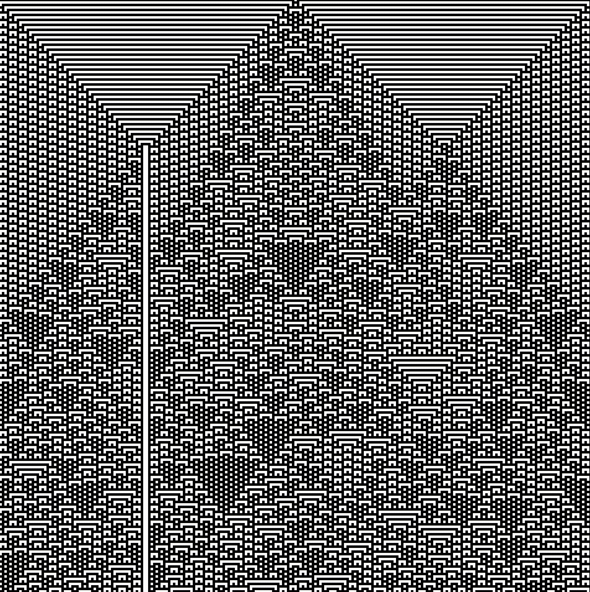

# Processing projects

These are some of my old Processing projects. Some of the images generated with these programs ended up in my [high-school thesis](./.assets/tesina.pdf) (if you don't know italian, you may still enjoy the pictures :)).

For some of these projects, I have taken inspiration from [Paul Bourke's personal pages](http://paulbourke.net/).
Some other inspiration comes from the book "The algorithmic beauty of plants" by Przemyslaw Prusinkiewicz and Aristid Lindenmayer, the [Numberphile YouTube channel](https://www.youtube.com/@numberphile/) and of course Wikipedia.

Some of the gifs are quite large, so they may take a while to load or freeze your browser... sorry about that :D

## [Diffusion Limited Aggregation](DiffusionLimitedAggregation)

Wiki: [Diffusion-limited aggregation](https://en.wikipedia.org/wiki/Diffusion-limited_aggregation)

A simulation of a Diffusion-limited aggregation process (DLA). The setup starts with a central attractor particle and multiple smaller particles scattered randomly across the screen. The particles move with Brownian motion, and if they collide with the attractor or with other "dead" particles, they become "dead" themselves and stop moving.


## [Elastic Collisions](ElasticCollisions)

Wiki: [Elastic collision](https://en.wikipedia.org/wiki/Elastic_collision)

A simulation of elastic collisions between multiple balls in a 2D environment. The setup initializes a grid of balls, each with a random initial velocity, and one of the balls is marked with a distinct color to track it's influence on the system. The balls move around the screen, bouncing off the walls and each other, conserving momentum and kinetic energy during collisions. This is not an impressive feat, but getting the collisions right took me more time than I'd like to admit. Furthermore, the simulation could be optimized with various ways, such as using a priority queue to keep track of the next collisions.

This similation can be used to demonstrate "high sensitivity to initial conditions". More precisely, if you nudge one of the balls just a tiny bit, the whole system will evolve in a completely different way given enough time.


## [Elementary Cellular Automata](ElementaryCA)

Wiki: [Elementary cellular automaton](https://en.wikipedia.org/wiki/Elementary_cellular_automaton)

An implementation of the well known 1D Elementary Cellular Automaton. The automaton evolves over time based on a specific rule, which determines the state of each cell in the next generation based on the state at the same position and its neighbors in the previous generation. This means that, for every possible configuration of three cells ($2^3$), a rule specifies the state of the center cell in the next generation. This gives $2^{2^3} = 256$ possible rules.

The rules shown below are 73, 126, 45 and 30, all with a single bit set to 1 (in the center) as the initial condition.



## [Chaos Game](ChaosGame)

Wiki: [Chaos game](https://en.wikipedia.org/wiki/Chaos_game)

This Processing project called "Chaos Game" demonstrates a form of iterated function system (IFS). The process to generate one of these is rather simple. For examle, to generate a Sierpinski triangle:

- Start with a set of vertices that form a triangle ($s = 3$)
- Choose a random point anywhere in the plane.
- Randomly select one of the vertices of the triangle.
- Move the point halfway ($r = 1/2$) towards the selected vertex.

For different regular polygons, you might want to choose $r$ to be the so-called "kissing number" of the polygon (see wiki page). The wiki page also explains modifications to the algorithm that are quite interesting.


## [Chaos Game 3D](ChaosGame3D)

Here is a 3D version of the "Chaos Game". It generates fractal patterns by moving a point towards randomly chosen vertices of a tetrahedron. I would like to do this with other polyhedra as well, but I haven't gotten around to it yet :)


## [Iterated Function Systems](SimpleIFS)

Wiki: [Iterated function system](https://en.wikipedia.org/wiki/Iterated_function_system), [Fractal Compression](https://en.wikipedia.org/wiki/Fractal_compression)

This project generates fractal patterns using an Iterated Function System (IFS).
This is similar in spirit to the "Chaos Game" project, but the IFS definition is more general.
An IFS is a collection of functions that are applied iteratively to a point in the plane. The functions are chosen randomly from a set of affine transformations, and the point is moved according to the chosen function. If the maps are contractive, the generated points will converge to an "attractor" that is often a fractal. One could also use non-linear transformations, and you would still have convergence :)

For example, the Barnsley fern is defined in code as follows:

```java
ifs.addFunction(new Function(0.85, 0.04, -0.04, 0.85, 0, 1.60, 0.85)); //  Successively smaller leaflets
ifs.addFunction(new Function(0.20, -0.26, 0.23, 0.22, 0, 1.60, 0.07)); //  Largest left-hand leaflet
ifs.addFunction(new Function(-0.15, 0.28, 0.26, 0.24, 0, 0.44, 0.07)); //  Largest right-hand leaflet
ifs.addFunction(new Function(0, 0, 0, 0.16, 0, 0, 0.01)); // Stem
```

The first 4 parameters of each function are the coefficients of the linear transformation, the next 2 are the translation, and the last one is the probability of choosing that function in the next iteration.

Starting from a random point, the program applies the functions iteratively, and you can see the fern emerge (on the right side of the gif below).


## [De Jong Attractors](DeJongAttractor)

This is another example of a fractal attractor stemming from a simple iterative process. Visit this [link](https://paulbourke.net/fractals/peterdejong/) for details and more examples.


## [The Logistic Map](LogisticMap)

Wiki: [Logistic map](https://en.wikipedia.org/wiki/Logistic_map)

This is a simple implementation of the logistic map fractal. The logistic map is a simple mathematical model for population growth, defined by the recursive formula:
$$x_{n+1} = r \cdot x_n \cdot (1 - x_n).$$
Here, $x_n$ is the population at time $n$ and $r$ is a parameter that you could think of as a growth rate.

Below, the $x$-axis represents the parameter $r$ (in the interval $[3, 4]$), and the $y$-axis represents the population. Starting from a population of $x_0 = 0.5$, we plot the populations $x_0, x_1, x_2, \ldots, x_{N}$ for a fixed number of iterations $N$. Initially (smaller values of $r$) the population converges to a stable equilibrium, but as $r$ increases, the system undergoes a period-doubling cascade and eventually enters a chaotic regime. The fun part of this project is that you can zoom in on the bifurcation diagram and see it's fractaly nature :D


This kind of period doubling cascade is a common feature of chaotic systems. The "Feigenbaum constant" $\delta \approx 4.6692016091029909$ is a universal constant that describes the rate at which the period-doubling bifurcations occur as $r$ increases. ((This is also the ratio of radii of successive circles in the Mandelbrot set, which of course is not a coincidence, but if you ask me why, I would probably show you [this image](https://www.researchgate.net/profile/Tssachin-Venkatesh/publication/343986739/figure/fig1/AS:930432354897922@1598843768697/The-real-line-on-the-mandelbrot-set-lines-up-with-the-bifurcations-in-the-logistic-map-1.jpg) and try to pass it as an explanation.))

## [Mandelbrot Set](Mandelbrot)

Wiki: [Mandelbrot set](https://en.wikipedia.org/wiki/Mandelbrot_set)

The Mandelbrot Set is a fractal set of complex numbers $c$ for which the sequence $z_{n+1} = z_n^2 + c$, with $z_0 = 0$,
does not diverge to infinity. The color of each point is determined by the number of iterations it takes for the sequence to diverge. You may ask, how do you decide that the sequence has diverged? It turns out that if $|z_n| > 2$, then the sequence will definetly diverge (as far as I remember, the proof is rather simple). So, if $|z_n| > 2$, we can stop the iteration and color the point based on the number of iterations it took to reach this condition.


In the figure above we did 7 iteration and used grayscale to represent the number of iterations. The big circle you see, is the circle of radius 2 in the complex plane. If $c$ is outside this circle, then $x_1 = c$, so we already know that the sequence will diverges after the first iteration. The regions of darker color are the ones that take more iterations to diverge, and the black region is the set of points for which we cannot prove that the sequence diverges after 7 iterations. The Mandelbrot set is defined as the limit set of the points for which the sequence does not diverge.

In this program we can zoom on the rich boundary of the Mandelbrot set and see the self-similarity of the set. The gif below shows a zoom on the boundary of the Mandelbrot set, with fancy colors.


## [Julia Sets](JuliaSets2)

Wiki: [Julia set](https://en.wikipedia.org/wiki/Julia_set)

The Julia set of a complex number $c$ is the set of points $z = z_0$ for which the sequence $z_{n+1} = z_n^2 + c$ does not diverge. The difference with the Mandelbrot set is that in the Julia set, $c$ is fixed and $z_0$ varies. In the gif below you can see how the value of $c$ viewed in relation to the Mandelbrot set affects the shape of the Julia set. For example, the Julia set is connected if and only $c$ is in the Mandelbrot set, and it is a Cantor set if $c$ is in the complement of the Mandelbrot set. You may try this program and see if you can find other interesting properties of the Julia set (e.g. observe the number of "petals" in the Julia sets changes as you change $c$).


## [Lorenz Attractor](LorenzAttractor2)

Wiki: [Lorenz system](https://en.wikipedia.org/wiki/Lorenz_system)

The Lorenz system is a set of three ordinary differential equations that describe a simple model of atmospheric convection. Edward Lorenz discovered that the system exhibits chaotic behavior for certain parameter values. The equations are:
$$
\begin{align*}
\dot{x} &= \sigma(y - x) \\
\dot{y} &= x(\rho - z) - y \\
\dot{z} &= xy - \beta z
\end{align*}
$$

where $\sigma, \rho, \beta \in \mathbb{R}.$ The gif below shows the evolution of 300 slightly different initial conditions in the Lorenz system with $\sigma = 10, \rho = 28, \beta = 8/3$. Even if the initial conditions are very close, the trajectories diverge exponentially.


## [Pythagoras Tree](PythagorasTree)

Wiki: [Pythagoras tree](https://en.wikipedia.org/wiki/Pythagoras_tree)

The Pythagoras tree fractal construction starts with a single square. At each iteration, two smaller squares are added to the sides of the previous square. The angle between the squares is usually $45^\circ$, but you can change it to get different shapes. I feel the gif below explains it better than I could with words :D


Fun fact: it is easy to prove that the area $A$ of the tree construscted with $45^\circ$ angles is finite, however the exact value is still unknown.

## [Ulam Spiral](UlamSpiral)

Wiki: [Ulam spiral](https://en.wikipedia.org/wiki/Ulam_spiral)

The Ulam spiral is a graphical representation of the set of prime numbers discovered by Stanisław Ulam in 1963 while doodling during a boring presentation. Starting from the center of the canvas, natural numbers are plotted in a spiral pattern. The prime numbers are then represented by white squares, while the composite numbers are black. The gif below shows the Ulam spiral with the first 10201 numbers. As you can see, prime numbers tend to align along diagonals. This translates to the existence of quadratic polynomials that generate a large number of primes for consecutive values of $n$. For example, the polynomial $n^2 + n + 41$ generates primes for $n = 0, 1, 2, \ldots, 39$.


## [Gravity](Gravity)

A visualization of gravitational fields generated by bodies in a 2D space. The field lines are drawn by calculating the net gravitational force at each grid point, and the user can interactively change the resolution and magnitude of the field visualization and the sketch dynamically updates the field lines to reflect the influence of all bodies present.


Playing around with the parameters, you can get some interesting results, like the one below :)


## [Chaikin's Algorithm](ChaikinsCurve)

A simple implementation of Chaikin's Algorithm for curve smoothing.


## [Coastline](Coastline)

Fractal coastlines using a recursive line subdivision approach. Starting with a square, each line is repeatedly divided into two segments with a random offset, creating a jagged, natural-looking coastline. [Coastline2](Coastline2) is a more advanced version of this project.


