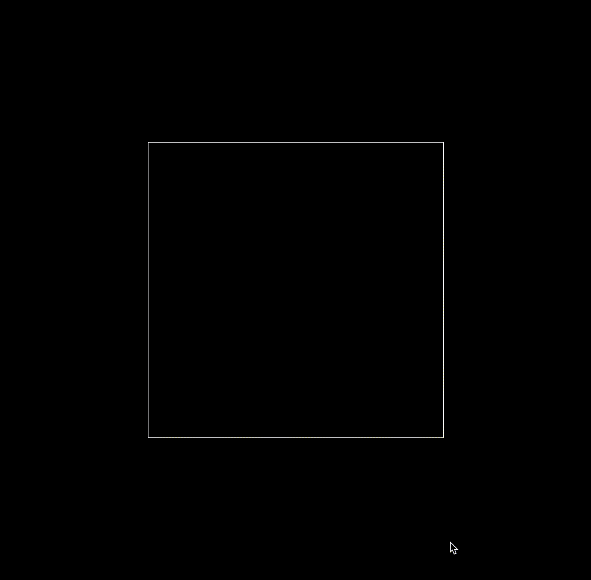
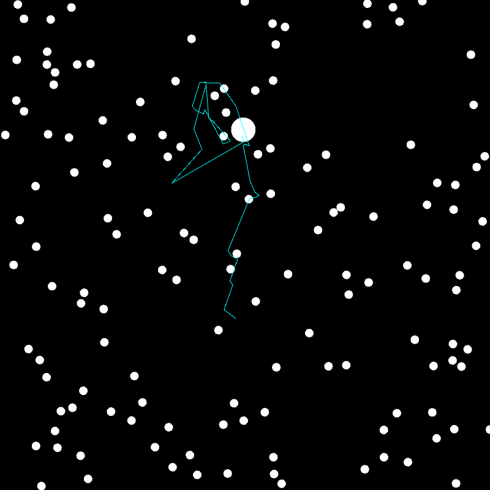

# processing-projects

These are some of my old Processing projects. Some of the images generated with these programs ended up in my [high-school thesis](./.assets/tesina.pdf) (if you don't know italian, you may still enjoy the pictures :)).

## [Chaikin's Algorithm](ChaikinsCurve)

This is a simple implementation of Chaikin's Algorithm for curve smoothing.

## [Chaos Game](ChaosGame)

## [Chaos Game 3D](ChaosGame3D)

## [Coastline](Coastline)

## [De Jong Attractor](DeJongAttractor)

## [Diffusion Limited Aggregation](DiffusionLimitedAggregation)

## [Elastic Collisions](ElasticCollisions)

## [Elementary Cellular Automata](ElementaryCellularAutomata)

## [Gravity](Gravity)

