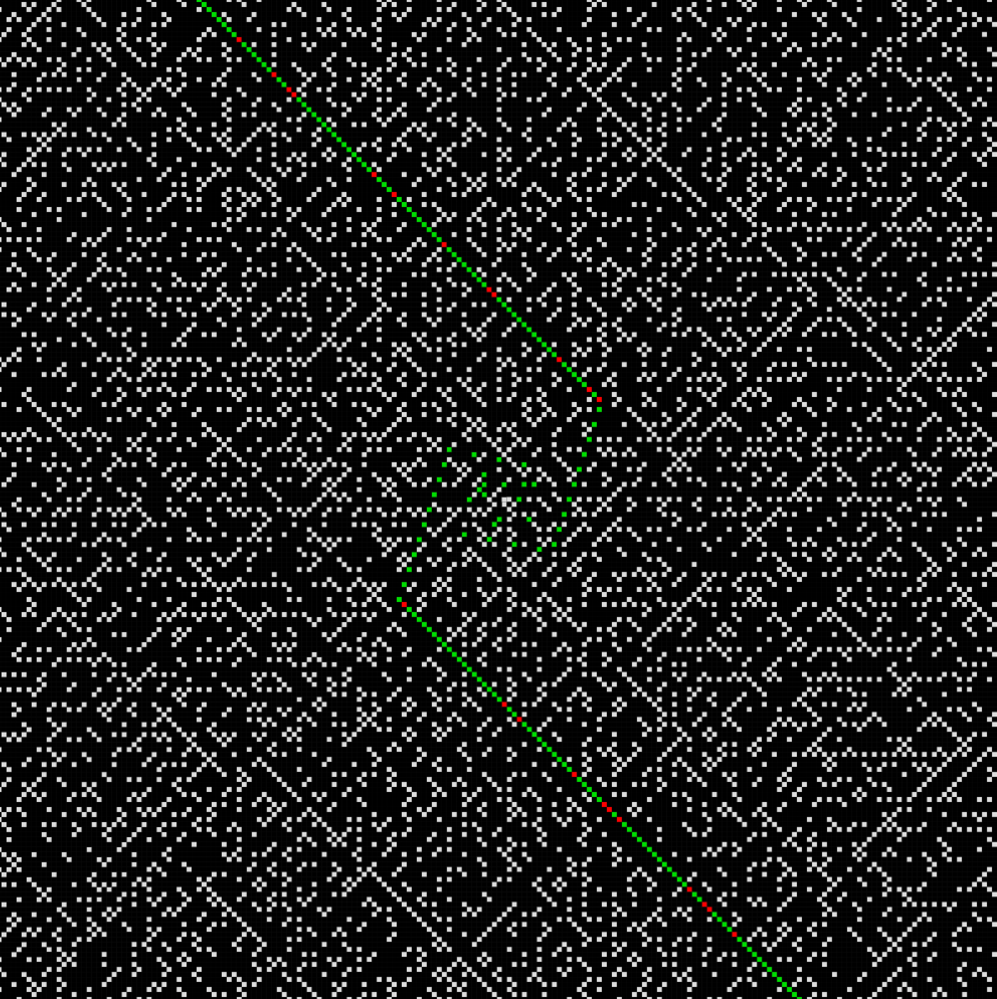

Wiki: [Ulam spiral](https://en.wikipedia.org/wiki/Ulam_spiral)

The Ulam spiral is a graphical representation of the set of prime numbers discovered by Stanisław Ulam in 1963 while doodling during a boring presentation. Starting from the center of the canvas, natural numbers are plotted in a spiral pattern. The prime numbers are then represented by white squares, while the composite numbers are black.

The GIF above shows the Ulam spiral with the first 10201 numbers. As you can see, prime numbers tend to align along diagonals. This translates to the existence of quadratic polynomials that generate a large number of primes for consecutive values of $n$. For example, the polynomial $n^2 + n + 41$ generates primes for $n = 0, 1, 2, \ldots, 39$. Below is the spiral for numbers $\leq 40000$, where I highlited the primes of the form $n^2 + n + 41$ in green and the non-primes in red.

